# Comparison of Machine Learning Prediction Models
Compared performance of different ML algorithms in both classification and regression tasks using scikit-learn framewok. The classification performance was evaluated by area under ROC and PR curves, the regression by MSE and R2 scores.
## Classification

### Dataset

1. [Diabetic Retinopathy](https://archive.ics.uci.edu/ml/datasets/Diabetic+Retinopathy+Debrecen+Data+Set)
2. [Default of credit card clients](https://archive.ics.uci.edu/ml/datasets/default+of+credit+card+clients)
3. [Breast Cancer Wisconsin](https://archive.ics.uci.edu/ml/datasets/Breast+Cancer+Wisconsin+(Diagnostic))
4. [Statlog (Australian credit approval)](http://archive.ics.uci.edu/ml/datasets/statlog+(australian+credit+approval))
5. [Statlog (German credit data)](https://archive.ics.uci.edu/ml/datasets/Statlog+(German+Credit+Data))
6. [Steel Plates Faults](https://archive.ics.uci.edu/ml/datasets/Steel+Plates+Faults)
7. [Adult](https://archive.ics.uci.edu/ml/datasets/adult)
8. [Yeast](https://archive.ics.uci.edu/ml/datasets/Yeast)
9. [Thoracic Surgery Data](https://archive.ics.uci.edu/ml/datasets/Thoracic+Surgery+Data)
10. [Seismic-Bumps](https://archive.ics.uci.edu/ml/datasets/seismic-bumps)

### Classifier
1. k-nearest neighbours classification
2. Support vector classification
3. Decision tree classification
4. Random forest classification
5. AdaBoost classification 
6. Logistic regression (for classification)
7. Gaussian naive Bayes classification
8. Neural network classification

### Result

  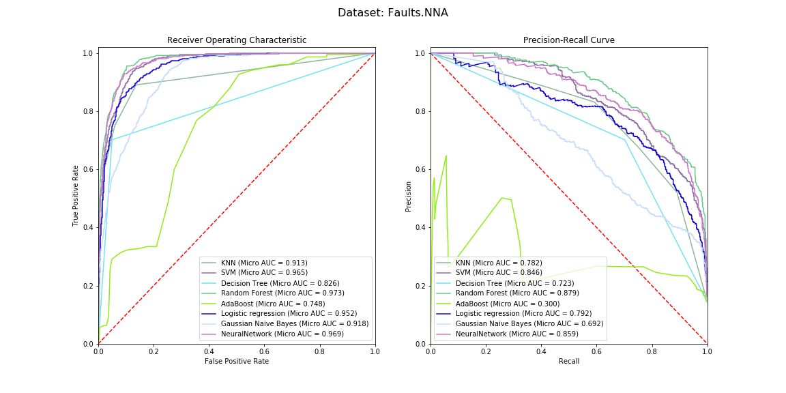
  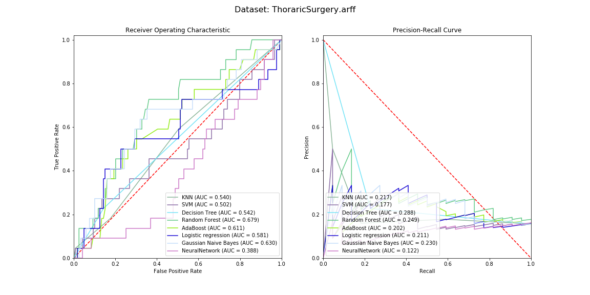
  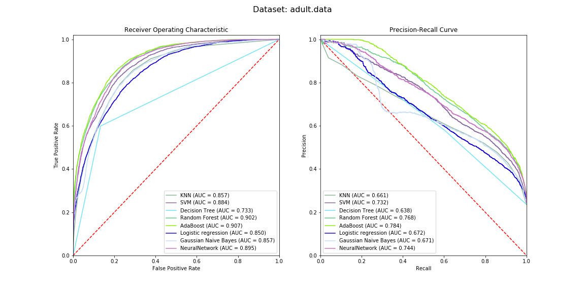
  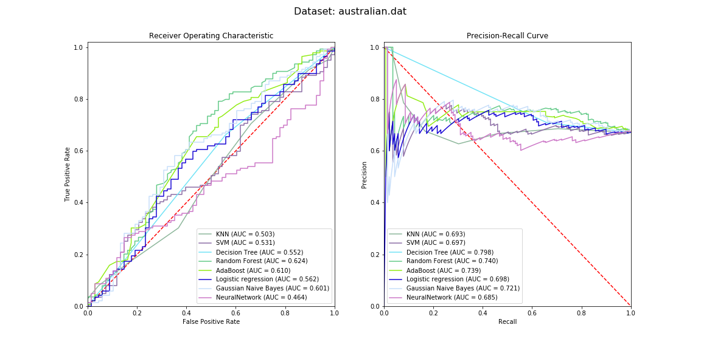
  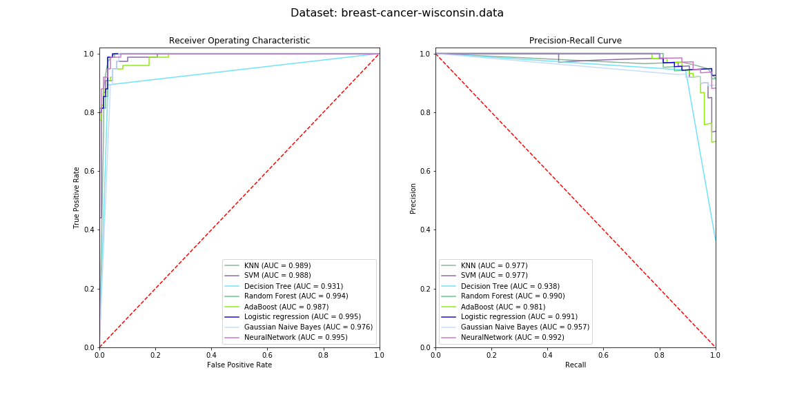
  
  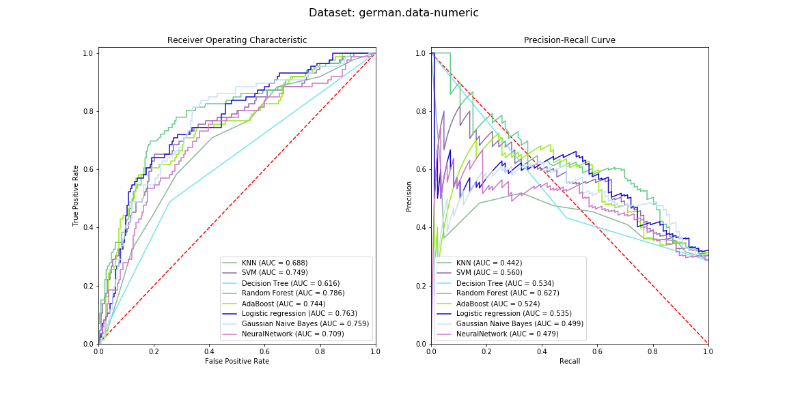
  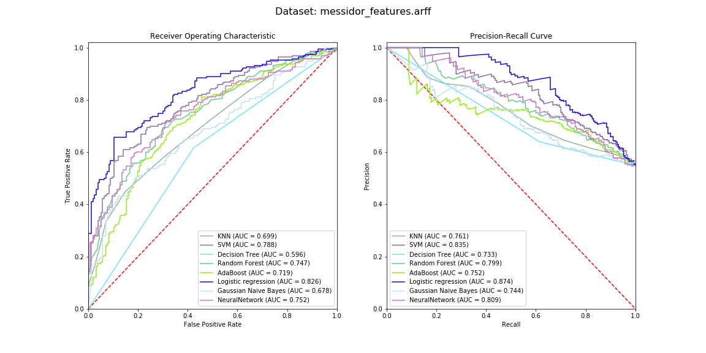
  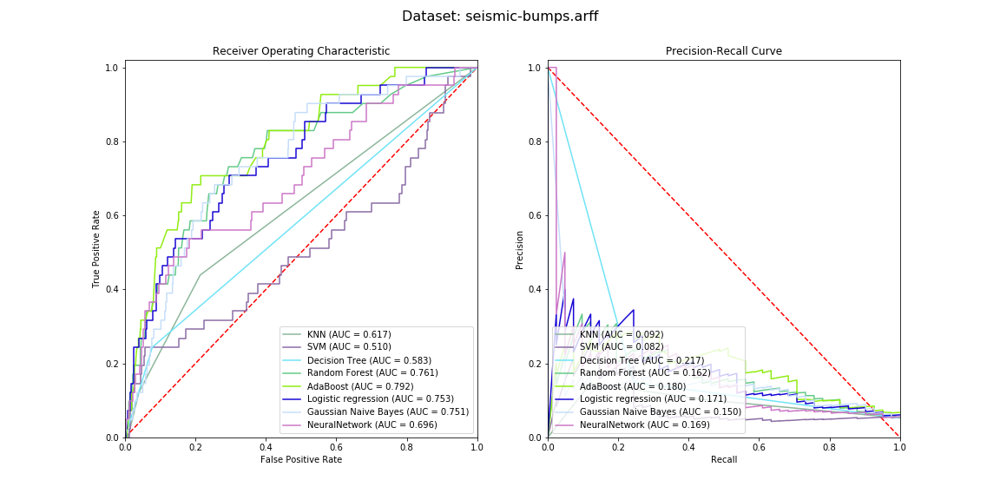
  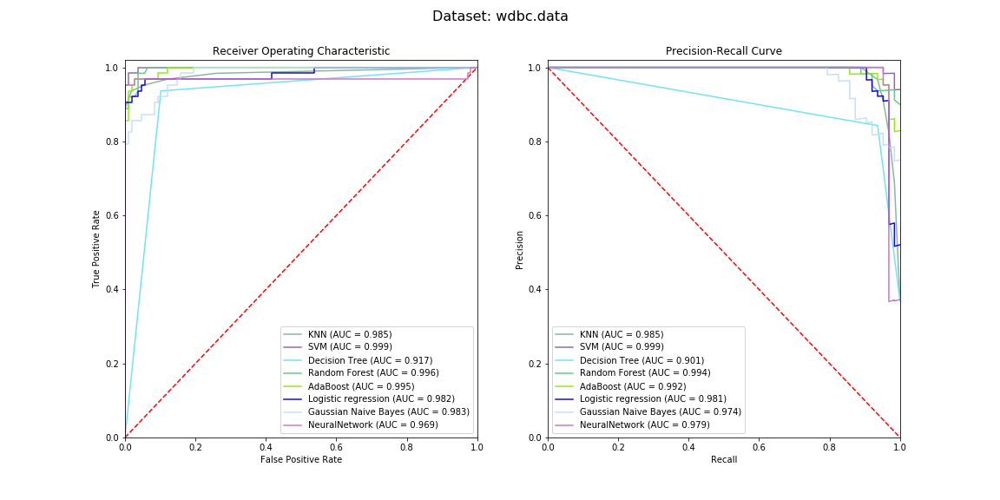
  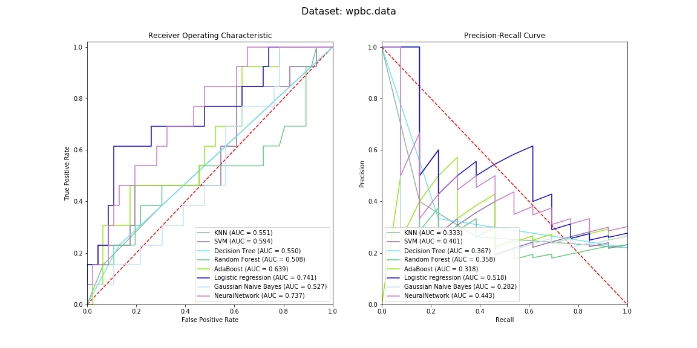
  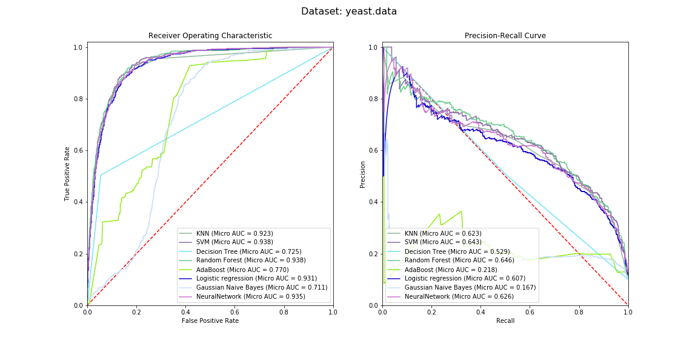

## Regression

### Dataset

1. [Wine Quality](http://archive.ics.uci.edu/ml/datasets/Wine+Quality)
2. [Communities and Crime](http://archive.ics.uci.edu/ml/datasets/Communities+and+Crime)
3. [QSAR aquatic toxicity](http://archive.ics.uci.edu/ml/datasets/QSAR+aquatic+toxicity)
4. [Parkinson Speech](http://archive.ics.uci.edu/ml/datasets/Parkinson+Speech+Dataset+with++Multiple+Types+of+Sound+Recordings)
5. [Facebook metrics](http://archive.ics.uci.edu/ml/datasets/Facebook+metrics)
6. [Bike Sharing](http://archive.ics.uci.edu/ml/datasets/Bike+Sharing+Dataset)
7. [Student Performance](http://archive.ics.uci.edu/ml/datasets/Student+Performance)
8. [Concrete Compressive Strength](http://archive.ics.uci.edu/ml/datasets/Concrete+Compressive+Strength )
9. [SGEMM GPU kernel performance](http://archive.ics.uci.edu/ml/datasets/SGEMM+GPU+kernel+performance)
10. [Merck Molecular Activity Challenge (from Kaggle)](https://www.kaggle.com/c/MerckActivity)

### Regressor
1. Support vector regression
2. Decision tree regression
3. Random forest regression
4. AdaBoost regression 
5. Gaussian process regression
6. Linear regression
7. Neural network regression

### Result

  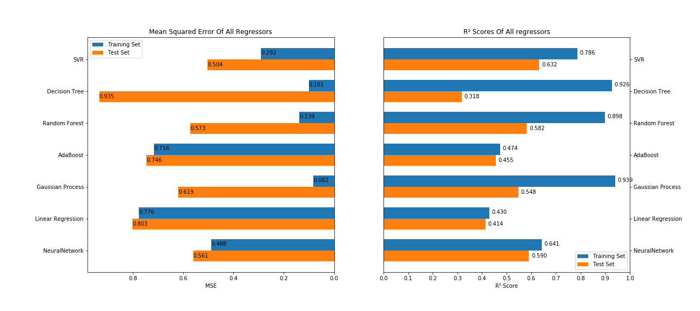
  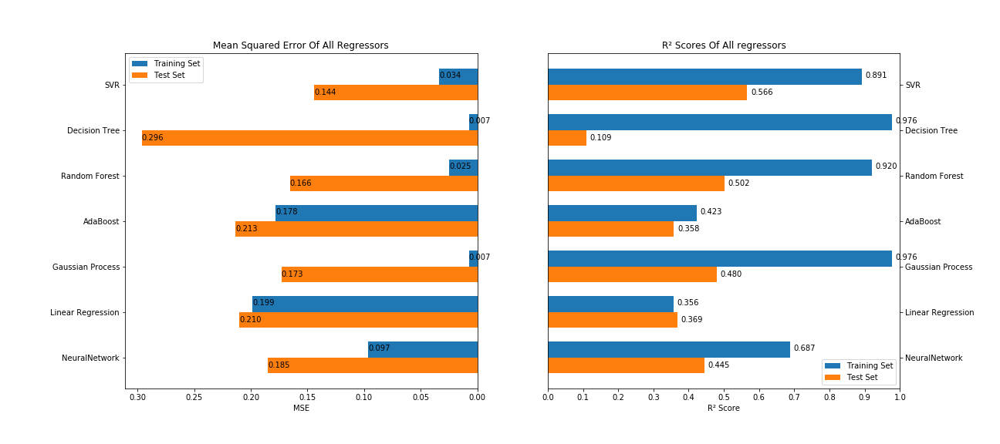
  
  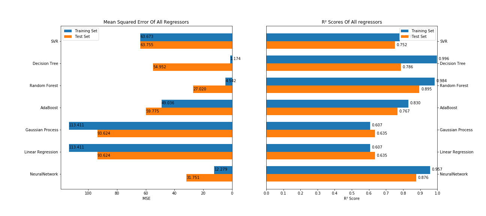
  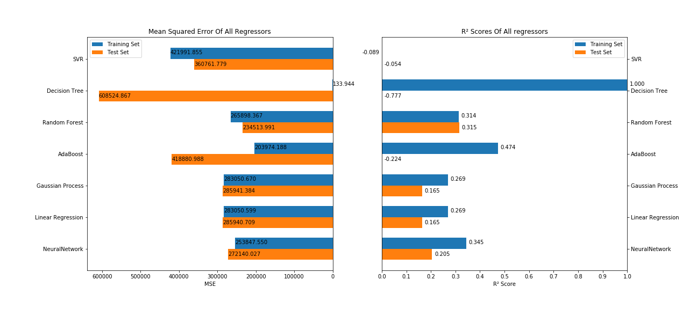
  
  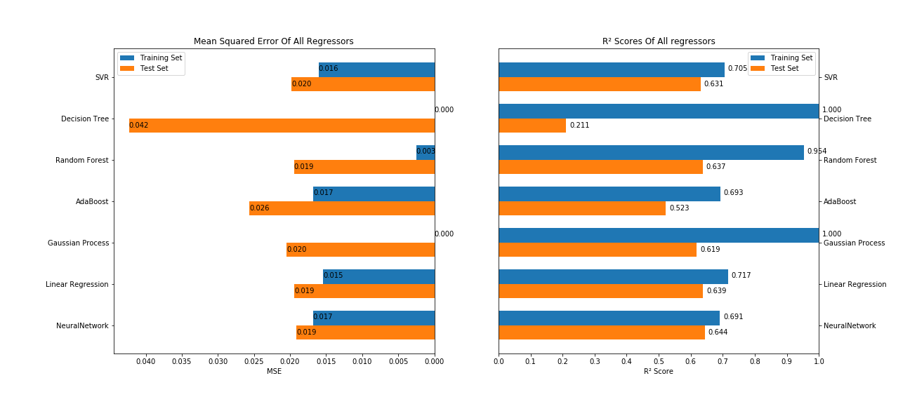
  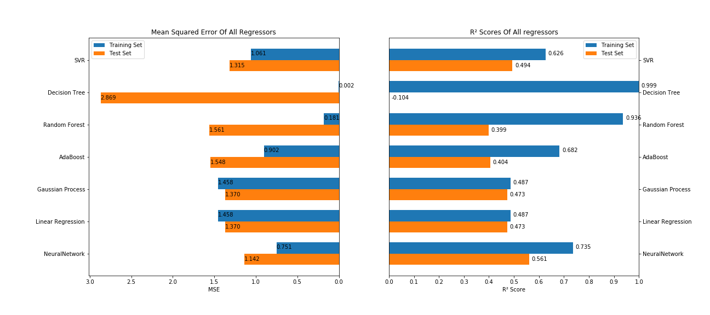
  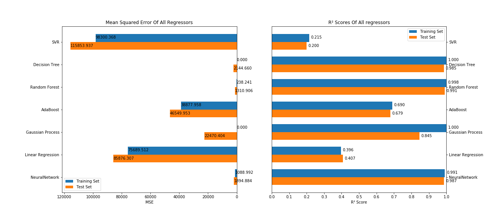
  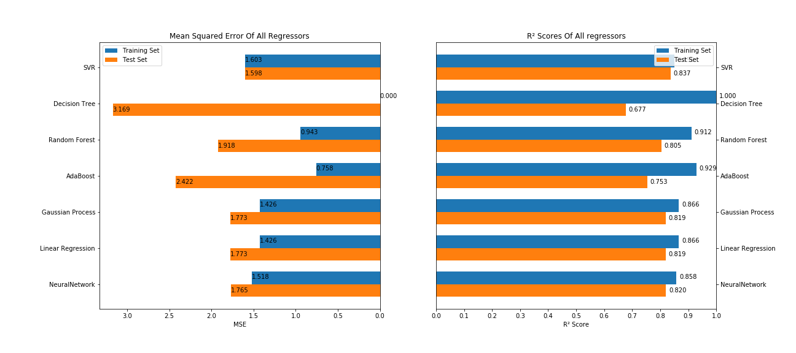
  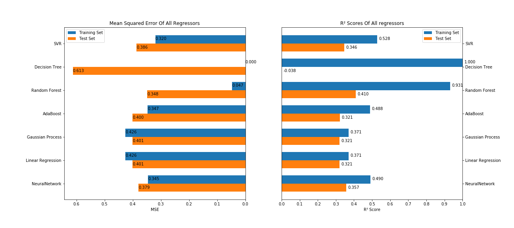
  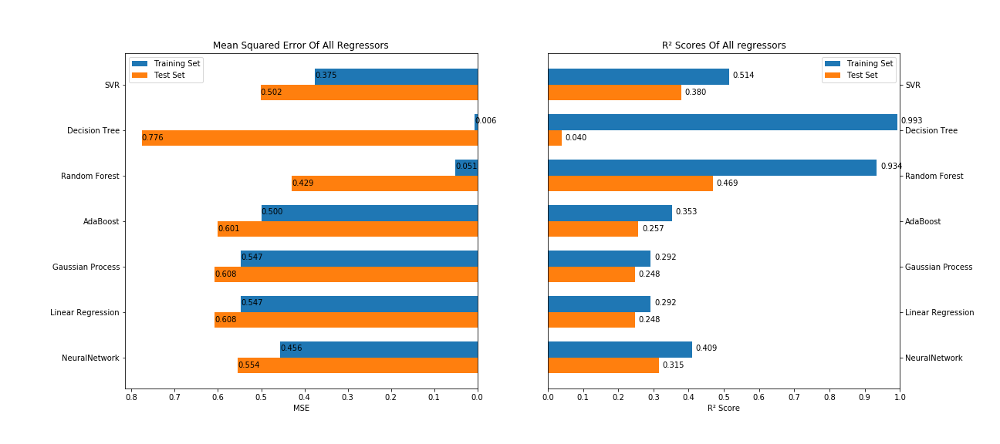

## Requirement

- Install [Anaconda](https://www.anaconda.com/)
- Create a conda env that contain python 3.7.5: `conda create -n your_env_name python=3.7.5`
- Activate the environment (do this every time you open a new terminal): `conda activate your_env_name`
- Install the requirements into this conda env: `pip install --user --requirement requirements.txt`
- Run the jupyter notebook: `jupyter notebook`
## Reference
- [scikit-learn](https://scikit-learn.org/stable/)
